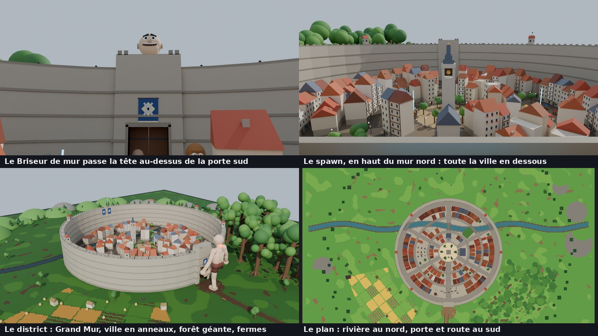
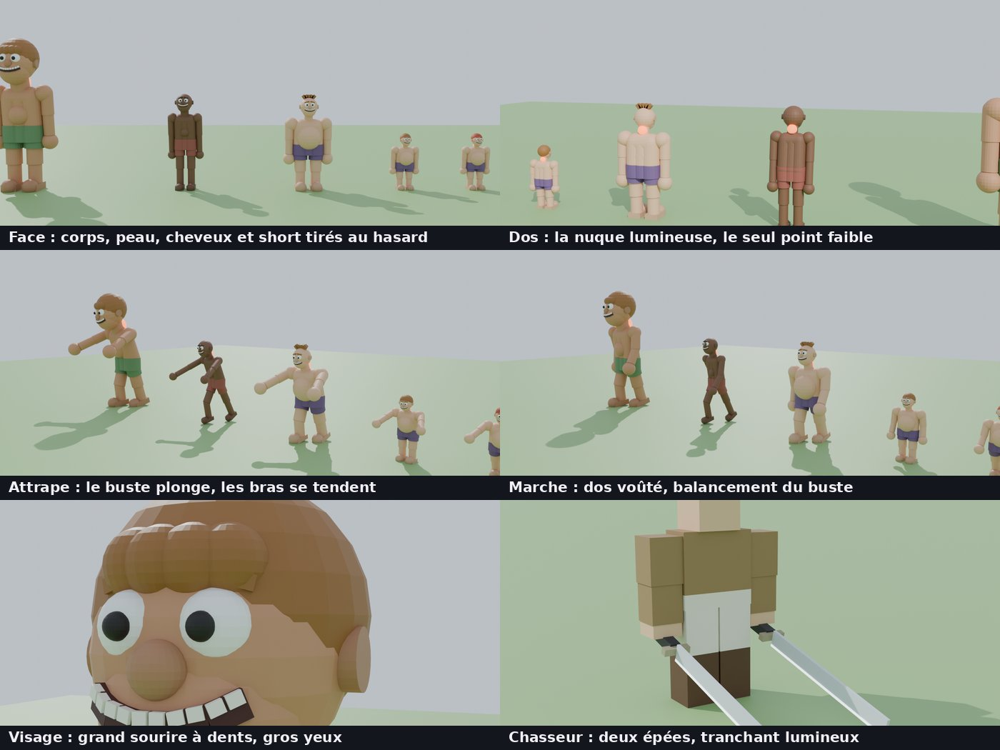
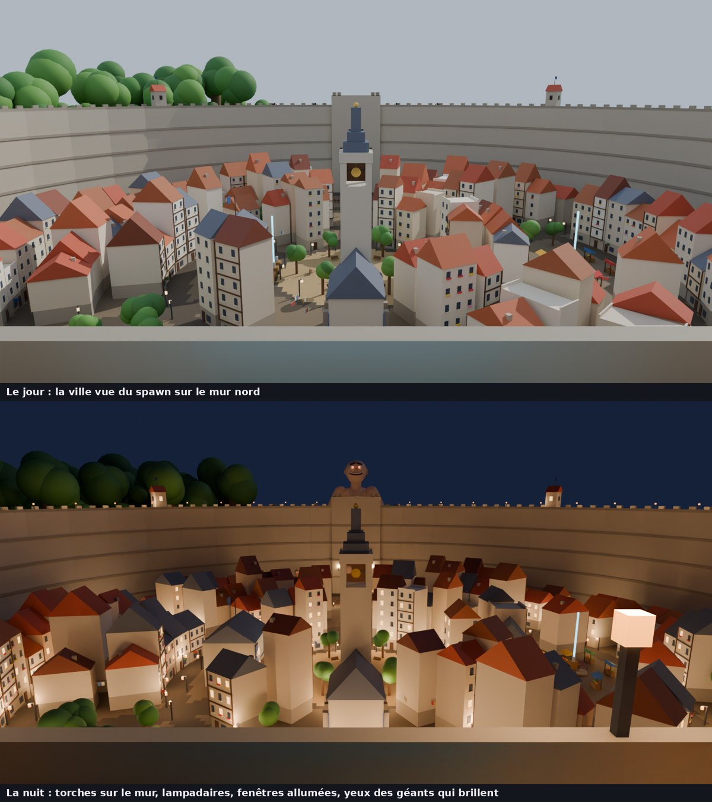
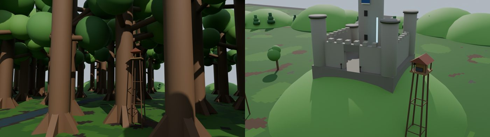
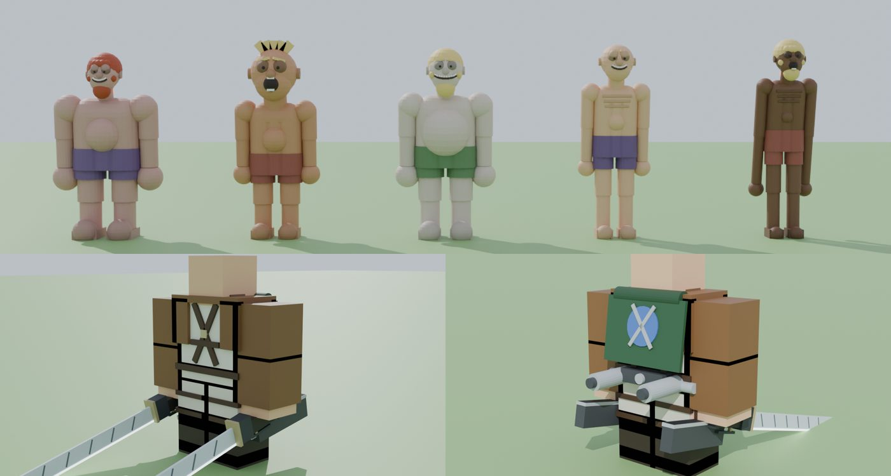

# Giant Hunters

A grapple-rig action game for Roblox: defend a walled district against
giants. Swing between the rooftops on two cable hooks and take giants down
by slashing the glowing weak spot on the back of their neck. It's inspired
by the "titan-slaying" genre, with an original setting and names, and it's
child-friendly: no gore, grabs are a game of wriggle-free, and defeated
giants puff away into steam.

This is a separate Rojo project from Brainrot Hatch Wars, in the same repo.











*Offline previews, rendered outside Roblox from the same building code
(so the lighting isn't Roblox's). Not Studio screenshots.*

## Run it

```bash
cd GiantHunters
rojo serve
```

In Studio, open a new **Baseplate** and delete the `Baseplate` and
`SpawnLocation` parts. Then **Plugins → Rojo → Connect** and press **Play**.
The district, the giants and the HUD all build themselves. You can also
`rojo build -o GiantHunters.rbxlx` and open the file.

## The world

- **The Great Wall**: a ring of stone 110 studs high round the whole town,
  with a walkway, merlons, stone bands, watchtowers, and iron grates where
  the river runs under it. You start **on top of the north wall**, with the
  whole town below you.
- **The south gate** is where every round starts: the **Wallbreaker**, a
  giant taller than the wall, appears outside in a flash of steam, peers
  over the gate and kicks it in. The doors burst inward, and the giants
  come through the breach. Save the district and the gate is rebuilt.
- **The town**: ring roads, avenues from a central plaza, and tight rows
  of tall old houses (stone ground floors, timber-framed upper floors,
  steep tiled roofs, chimneys with smoke, washing lines across the alleys).
  Every face is something to hook.
- **Landmarks**: the plaza fountain and its statue of the first hunter, the
  church bell tower (the highest perch in town), the hunters' headquarters
  and supply depot, the market, a garden, the gate square with barricades,
  bridges over the river.
- **Outside** (the land reaches 1300 studs from the centre): the forest of
  giant trees (a hunters' platform with a supply crate up one trunk),
  farms with a windmill and wheat fields, the road from the gate, the
  plains, and a closed ring of hills all round with firs on their slopes.
  The river runs out of town east and west and ends in a pool at each end.
- **The edge of the world**: the land is round, and an invisible wall
  stands just inside the hill ring (at 1290 studs, 420 high), so nobody
  walks or swings off the map. Hooks pass through it.
- **The Great Forest** (east): 76 trees taller than the wall (160-230
  studs) and nothing else, spread over half a kilometre. The place to
  swing from trunk to trunk at full speed; a few trunks carry platforms
  with supplies and a torch on the deck, and old trunks lean out over the
  river.
- **The Training Grounds** (north, behind the wall): practice trees and 18
  wooden giant dummies, some up on stilts, with a target on the back of
  the neck. Cut them to practise your approach: the HUD tells you your
  speed and whether it was a clean cut. No blades used, no points. The
  north road skirts round the grounds instead of cutting through them.
- **The old castle** (west), on its hill: curtain walls with one side
  fallen in, corner towers, a tall round keep, a supply crate. The west
  road ends at a dirt ramp up to its gate.
- **Signal towers** every 130 studs along the dirt roads that link the
  gate, the castle, the forest and the training grounds (and down the
  south road), more in a ring round the outer plains, and **groves of
  giant trees** dotted everywhere else. A last pass plants a lone giant
  tree wherever a spot is still more than 140 studs from something tall:
  there's always something to hook onto, so you can cross the whole land
  on your cables. A wooden bridge takes the north road over the river.
- **Supplies out in the wilds**: on every other signal tower, in every
  other grove, on the tree platforms, at the castle, the training grounds
  and a few lonely spots in the far north and the Great Forest, each with
  a blue beam.
- **Where giants appear**: out on the southern plains, 680 studs from the
  centre, in the open between the forest and the farms.

### Performance

The map is about 10,600 parts, built into a folder outside the Workspace
and dropped in at once (each layer is timed in the output, and a layer
that fails is skipped with a warning instead of stopping the server).
**Streaming is on**: clients load what's within about 1,000 studs. The
wall, the gate and the spawn post are one persistent model (always
there); trees, towers and houses stream in and out whole. Nothing in the
map listens for touches, small parts and leaves cast no shadow, and
leaves, fences and braces are hookable but not solid. Lamps and torches
are only lit at night, half the wall torches carry a real light, and on
phones (or graphics level 4 and below) only the lights and flames within
220 studs of the camera burn.
- **Wall cannons** either side of the gate: fire one at a giant to daze it.

## The hunters' uniform

Every hunter wears the corps' uniform over their avatar: a short brown
jacket over a white shirt, white trousers, tall dark boots, leather straps
across the chest and round the thighs, and a green cape with the corps'
crossed-blades emblem. The grapple rig is on show: the reel box at the
small of the back with its hook launchers, a gas tank either side, and a
blade box low on each hip. The swords have a pistol-grip handle with a
trigger, a squared hilt and a long blade scored with snap lines and cut
off at an angle at the tip.

## Day and night

A full 24 hours passes every 16 real minutes (`Config.DayNight`). The
server only moves the clock; each client paints the sky from it
(`Sky.lua`): blue noon, a gold and red sunset, a dark blue night with stars
and a big moon, an orange dawn, with the atmosphere, colours, bloom, sun
rays and clouds all changing with the hour.

At night it's properly dark: torches burn along the whole wall and round
the plaza and the gate square, the street lamps light up along the
avenues, ring roads and bridges, and 4 windows in 10 glow warm. The
giants' tiny pupils glow orange in the dark, and they walk 20% faster.

## Titan shifters

Now and then a glowing **purple crystal** appears in town (the plaza, the
headquarters, the market, the gate square or the garden). Whoever takes it
gets the **titan power** (never more than 2 players at once) and picks a
side:

- **Hunters' side** (blue outline): your punches crush giants (they count
  as your takedowns) and your roar dazes them.
- **Giants' side** (red outline): your punches knock hunters out (they
  respawn on the wall) and your roar blows them away. Hunters can cut your
  nape: 3 hits and you're thrown out of the titan, and the power is gone.

Titans on opposite sides can fight each other. Press **T** to transform
(60 s, then a 40 s cooldown) and T again to change back. As a titan, click
or F punches and G roars. Hooks, gas and blades are put away.

## The Beast Giant

From wave 3 a **Beast Giant** sometimes appears (one at a time). It throws
**boulders** at hunters who think they're safe on the rooftops or far
away (they take over a second to land: keep moving), and **roars** away
anyone who comes close. Worth 12 points.

## Controls

| Action | PC | Gamepad | Mobile |
|---|---|---|---|
| Left / right hook (hold, then swing) | Q / E | L1 / R1 | "L Hook" / "R Hook" |
| Reel in (hooked) / gas boost (in the air) | hold Space | A | "Gas" |
| Gas dash | Shift | B | "Dash" |
| Slash with both blades (a full spin in the air) | Click or F | X | "Slash" |
| Signal flare | G | Y | "Flare" |
| Transform into a titan (with the titan power) | T | D-pad up | "Titan" |
| Titan: punch / roar | Click or F / G | X / Y | "Punch" / "Roar" |
| Wriggle free when grabbed | mash any of the above | | tap |
| Resupply gas & blades | stand at a crate with a blue beam | | |
| Fire a wall cannon | stand next to it | | |

Shift-lock (camera lock) makes aiming easier: the crosshair turns green
when a hook would land.

### The grapple, like the anime's gear

- A hook **flies** to what you aim at, then bites. The cable stays taut
  (it winds in any slack), so gravity swings you round the anchor like a
  pendulum. Let go at the bottom of the swing to fling yourself forward.
- Hook both sides at once to swing between two anchors.
- Hold Space while hooked to **reel in** hard (uses gas): that's how you
  zip up a giant's back to its neck.
- Hooks can bite giants too, and move with them.
- In the air you steer with WASD, face where you fly and lean into dives.
  A slash in the air is a full spin with blade trails.
- Gas shows as white jets behind you, the view widens and the wind picks
  up with speed. Other hunters see your cables.

## How it plays

- **Rounds**: a short breather, the Wallbreaker breaches the gate, then 5
  waves pour in. The last wave brings an **Armored Giant**. Clear it and
  the district is saved; the next round is a little harder.
- **The three cuts**:
  - **Nape** (the glowing lump on the back of the neck), from behind or
    the side: the only thing that takes a giant down. Hit it going fast
    (35+ studs/s) for a **clean cut** (full damage); slow hits do half.
  - **Eyes** (from in front): the giant is **dazed** for 4 s: hands over
    its face, stars round its head, no grabbing.
  - **Ankles**: the giant drops to its **knees** for 4.5 s, bringing its
    nape within easy reach.
- **Giants**:
  - **Small / Giant / Colossal**: they chase the nearest hunter they can
    reach. On a rooftop above their heads, you're safe.
  - **Runner** (an abnormal): fast, zig-zags, leaps, and picks its own
    target. Yellow shorts, odd eyes.
  - **Armored Giant**: rock plates; the one over its nape has to be
    cracked (3 hits) before the nape can be cut.
  - All of them are part-built, soft and rounded, with a hunched walk and
    eyes that follow you. Each rolls a body (lanky, stocky, chubby,
    big-headed, or **gangly**: thin as a rake, stooped, arms hanging past
    its knees), an expression (a wide toothy grin, a dopey half-asleep
    stare, or a gaping mouth full of teeth), hair, sometimes a beard, a
    nose size, and ribs on the skinny ones. The Beast is a bearded gangly
    one.
- **Grabs**: a giant raises its arms first (the warning). If it catches
  you, you're held in its hand: **mash to wriggle free**, or a friend can
  cut you loose (any cut on that giant). Not free after 3.5 s? You're
  caught and sent back to the wall.
- **Swats**: fly round a giant's head in front of it and it swats you
  away. It can't see behind it - **attack from behind**.
- **Blades**: a sword in each hand, 8 blades per life, one used per hit.
  With none left they turn dull and grey. Resupply at a crate (the wall
  post, the plaza, the headquarters, the market, the gate square, the
  forest platform).
- **Gas**: used to reel in, boost and dash. Refills slowly on the ground,
  or fully at a crate.
- **Score**: points per giant (Small 1, Giant 2, Runner 3, Colossal 4,
  Armored 8), times your **combo** (takedowns within 8 s of each other, up
  to x5), +1 for a takedown at 70+ studs/s. Trips, dazes and cannon hits
  are worth 1, cracking armour 2, rescuing a friend 3. Ranks: Recruit,
  Scout, Hunter, Veteran, Captain, Commander.

## The HUD

Crosshair with left/right hook marks (yellow flying, green hooked); the
gear panel (two gas tanks, two boxes of four blades, your speed, rank and
points); a hint when a cut is in reach ("SLASH THE NAPE!", "TRIP",
"DAZE"); the round and wave banner; announcements; a kill feed; the combo
counter; a radar that turns with the camera (giants red, runners orange,
armoured grey, hunters blue, crates cyan, the gate yellow, the wall a
ring); the GRABBED! screen with a wriggle meter.

## Sounds

The game uses a few sound files that ship with every Roblox client
(`rbxasset://sounds/...`: the classic sword slash, lunge and unsheath, the
character landing thud, falling wind, water splash). Nothing is uploaded
and there are no asset ids to set up. They haven't been checked in Studio
from here, so if one doesn't play, swap its id in `Config.Sounds` for any
sound you've uploaded (`rbxassetid://...`).

## Code map

| File | What |
|---|---|
| `src/shared/Config.lua` | every tuning number: grapple, blades, cuts, scoring, giants, waves, world, sounds |
| `src/shared/Geo.lua` | the district's geometry (river and pools, the castle hill) and the giants' route-finding (round the wall, through the gate only when breached) |
| `src/server/MapBuilder.lua` | builds the world from the layers below, off-Workspace, timed and protected layer by layer; streaming modes |
| `src/server/World/Ground.lua` | Smooth Terrain: the round land, paving and roads, grass patchwork, fields, river and pools, hills, the castle ramp |
| `src/server/World/Wall.lua` | the Great Wall, the breachable gate, watchtowers, cannons, the spawn post (one persistent model) |
| `src/server/World/Town.lua` | row houses, plaza, church, headquarters, market, garden, bridges |
| `src/server/World/Wilds.lua` | giant forest, the Great Forest, training grounds, castle, signal towers, groves, farms, windmill, roads and bridges, plains, supplies, hook coverage, giant entry points, the edge of the world |
| `src/server/World/Kit.lua`, `Layout.lua` | shared part helpers and set pieces; where the big pieces go, the roads, the hill ring and ground height |
| `src/server/GiantFactory.lua` | part-built giant rig (rounded body, face, armour, Motor6D waist/limbs/neck, glowing nape, kinematic mover) |
| `src/server/GiantService.lua` | giant AI, grabs and holds, swats, the three cuts, armour, takedowns, the Wallbreaker |
| `src/server/WaveService.lua` | rounds and waves (and the odd Beast Giant) |
| `src/server/DayNightService.lua` | the 24-hour clock |
| `src/server/ShifterService.lua` | the titan crystal, sides, transforming, punches, roars, titan napes |
| `src/server/HunterService.lua` | characters, leaderboard and ranks, twin swords, blades, resupply, slash validation, combos, flares, cable relay |
| `src/server/HunterGear.lua` | the hunters' uniform, cape and grapple rig, built over each avatar |
| `src/server/CannonService.lua` | the wall cannons |
| `src/server/Broadcast.lua` | kill feed, announcements, camera shakes |
| `src/client/GrappleController.lua` | flying hooks, taut-cable swing, reel, gas boost and dash, air spin slash, flares, being grabbed or swatted, other hunters' cables |
| `src/client/GiantAnimator.lua` | client-only animation (walk, grab, hold, swat, kneel, daze, leap, kick, stare), footsteps, daze stars |
| `src/client/Hud.lua`, `Radar.lua` | the HUD and the radar |
| `src/client/Effects.lua` | camera shake, sounds, hit bursts, the windmill |
| `src/client/SkyController.lua`, `src/shared/Sky.lua` | the sky by the hour; lamps, torches, windows and giants' eyes at night |
| `src/client/ShifterController.lua` | choosing a side, T to transform, titan punch and roar |

Movement runs on each player's own client, so the grapple feels instant.
Damage is always validated by the server (cooldown, blades left, real
distance to the nape, eyes or ankle).
