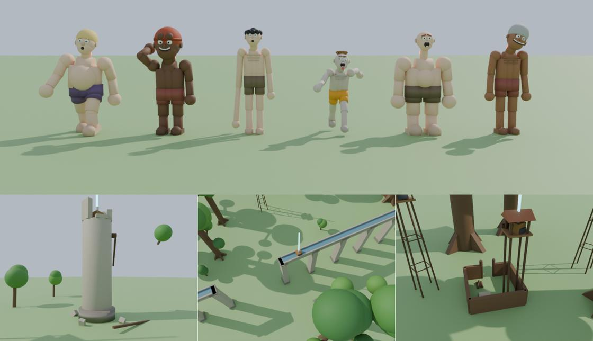
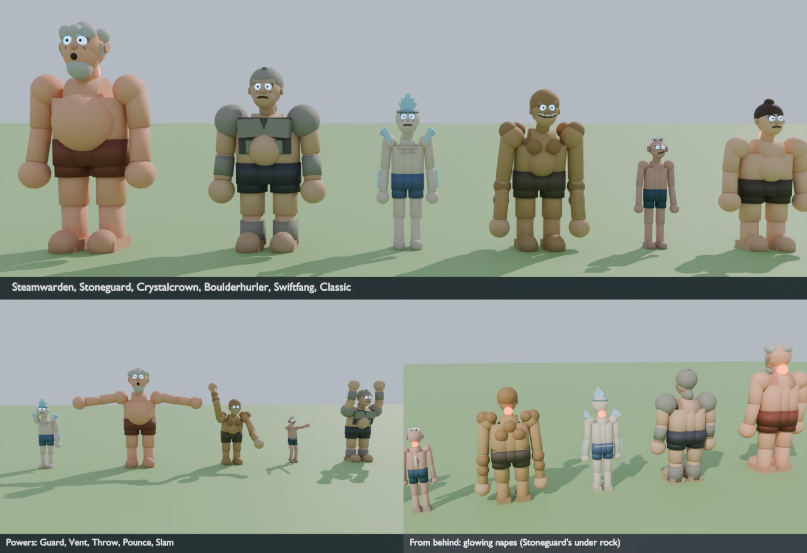

# Giant Hunters

A grapple-rig action game for Roblox: defend a walled district against
giants. Swing between the rooftops on two cable hooks and take giants down
by slashing the glowing weak spot on the back of their neck. It's inspired
by the "titan-slaying" genre, with an original setting and names, and it's
child-friendly: no gore, grabs are a game of wriggle-free, and defeated
giants puff away into steam.

This is a separate Rojo project from Brainrot Hatch Wars, in the same repo.




*Offline previews, rendered outside Roblox from the same building code
(so the lighting isn't Roblox's). Not Studio screenshots.*

## Run it

```bash
cd GiantHunters
rojo serve
```

In Studio, open a new **Baseplate** (its `Baseplate` and `SpawnLocation`
are removed automatically when the map builds). Then **Plugins → Rojo →
Connect** and press **Play**.
The district, the giants and the HUD all build themselves. You can also
`rojo build -o GiantHunters.rbxlx` and open the file.

On Play in Studio, a self-check (`StudioCheck.lua`) prints a PASS / WARN /
FAIL list to the Output window: the map (spawn, crates, dummies, cannons,
boundary, part count), the remotes, streaming, whether saving works (turn on
**Game Settings > Security > Enable Studio Access to API Services**), the
shop's items, and that every giant kind and titan form builds.

## The world

- **The Great Wall**: a ring of stone 110 studs high round the whole town,
  with a walkway, merlons, stone bands, watchtowers, and iron grates where
  the river runs under it. You start **on top of the north wall**, with the
  whole town below you.
- **The south gate** is where every round starts: the **Wallbreaker**, a
  giant taller than the wall, appears outside in a flash of steam, peers
  over the gate and kicks it in. The doors burst inward, and the giants
  come through the breach. Save the district and the gate is rebuilt.
- **The town**: ring roads, avenues from a central plaza, and tight rows
  of tall old houses (stone ground floors, timber-framed upper floors,
  steep tiled roofs, chimneys with smoke, washing lines across the alleys).
  Every face is something to hook.
- **Landmarks**: the plaza fountain and its statue of the first hunter, the
  church bell tower (the highest perch in town), the hunters' headquarters
  and supply depot, the market, a garden, the gate square with barricades,
  bridges over the river.
- **Outside** (the land reaches 1300 studs from the centre): the forest of
  giant trees (a hunters' platform with a supply crate up one trunk),
  farms with a windmill and wheat fields, the road from the gate, the
  plains, and a closed ring of hills all round with firs on their slopes.
  The river runs out of town east and west and ends in a pool at each end.
- **The edge of the world**: the land is round, and an invisible wall
  stands just inside the hill ring (at 1290 studs, 420 high), so nobody
  walks or swings off the map. Hooks pass through it.
- **The Great Forest** (east): 76 trees taller than the wall (160-230
  studs) and nothing else, spread over half a kilometre. The place to
  swing from trunk to trunk at full speed; a few trunks carry platforms
  with supplies and a torch on the deck, and old trunks lean out over the
  river.
- **The Training Grounds** (north, behind the wall): practice trees and 18
  wooden giant dummies, some up on stilts, with a target on the back of
  the neck. Cut them to practise your approach: the HUD tells you your
  speed and whether it was a clean cut. No blades used, no points. The
  north road skirts round the grounds instead of cutting through them.
- **The old castle** (west), on its hill: curtain walls with one side
  fallen in, corner towers, a tall round keep, a supply crate. The west
  road ends at a dirt ramp up to its gate.
- **Signal towers** every 130 studs along the dirt roads that link the
  gate, the castle, the forest and the training grounds (and down the
  south road), more in a ring round the outer plains, and **groves of
  giant trees** dotted everywhere else. A last pass plants a lone giant
  tree wherever a spot is still more than 140 studs from something tall:
  there's always something to hook onto, so you can cross the whole land
  on your cables. A wooden bridge takes the north road over the river.
- **Supplies out in the wilds**: on every other signal tower, in every
  other grove, on the tree platforms, at the castle, the training grounds
  and a few lonely spots in the far north and the Great Forest, each with
  a blue beam.
- **Landmarks** to steer by and swing along: the **old mill tower**, a
  broken stone ruin in the far north-west with a crate on the floor of its
  fallen-in top; the **aqueduct**, a line of 64-stud stone arches striding
  across the north-east plains and over the north road (a few spans have
  fallen; a crate sits in the channel halfway); and the **watch-fort** where
  the east road enters the Great Forest: a log stockade, a lookout tower
  with a crate on its deck, a banner and a torch.
- **Town life**: townsfolk stroll the streets by day (fewer at night and in
  the rain). They step out of doors near you, and when the giants come (or
  one gets close) they hurry back indoors. Flocks of birds circle over the
  roofs and treetops and scatter when a giant comes near; washing flaps on
  the lines and the market awnings sway. All of it lives only on each
  player's own screen, near the camera: up to 30 villagers (14 on phones),
  seven parts each, and three flocks.
- **Where giants appear**: out on the southern plains, 680 studs from the
  centre, in the open between the forest and the farms.

### Performance

The map is about 10,800 parts, built into a folder outside the Workspace
and dropped in at once (each layer is timed in the output, and a layer
that fails is skipped with a warning instead of stopping the server).
**Streaming is on**: clients load what's within about 1,000 studs. The
wall, the gate and the spawn post are one persistent model (always
there); trees, towers and houses stream in and out whole. Nothing in the
map listens for touches, small parts and leaves cast no shadow, and
leaves, fences and braces are hookable but not solid. Lamps and torches
are only lit at night, half the wall torches carry a real light, and on
phones (or graphics level 4 and below) only the lights and flames within
220 studs of the camera burn.
- **Wall cannons** either side of the gate: fire one at a giant to daze it.

## The hunters' uniform

Every hunter wears the corps' uniform, whatever their avatar. The server
re-dresses the avatar through its HumanoidDescription (no asset ids):
classic shirt and pants, layered clothing and back, waist, shoulder, front
and neck accessories come off (hair, hats and the face stay), the body goes
back to the default shape at normal scale, and the body colours become the
uniform: a white shirt, brown jacket sleeves, white trousers. On top go the
thin pieces: the jacket's panels over the torso and its collar, darker
cuffs, tall dark boots, leather straps across the chest and round the
thighs, a belt, and a green cape with the corps' crossed-blades emblem. If
the avatar can't be re-dressed, fabric shells cover every body part
instead. The grapple rig is on show: the reel box at the small of the back
with its hook launchers (the cables leave from their tips), a gas tank
either side, and a blade box low on each hip, behind the hands. The swords
sit in the fist (the hand's grip attachment, on R15, R6 and Rthro alike),
tipped up a little, with a pistol-grip handle and a trigger, a squared hilt
and a long blade scored with snap lines and cut off at an angle at the tip.

## Day and night

A full 24 hours passes every 16 real minutes (`Config.DayNight`). The
server only moves the clock; each client paints the sky from it
(`Sky.lua`): blue noon, a gold and red sunset, a dark blue night with stars
and a big moon, an orange dawn, with the atmosphere, colours, bloom, sun
rays and clouds all changing with the hour.

At night it's properly dark: torches burn along the whole wall and round
the plaza and the gate square, the street lamps light up along the
avenues, ring roads and bridges, and 4 windows in 10 glow warm. The
giants' tiny pupils glow orange in the dark, and they walk 20% faster.

## Weather

Every 6 to 11 minutes a **soft rain** or a **fog bank** rolls in for 2 to
4 minutes (`Config.Weather`), with a quiet line in the feed. The server
only picks it (the Workspace attribute `Weather`); each client fades it in
over 20 seconds: the sky greys and the clouds close in, or the air turns
to a pale haze (`Sky.WithWeather`), and rain falls round the camera (a
third as much on phones). Nothing scary: no storms, no thunder. It never
starts while someone is doing the tutorial, and stays clear on the screen
of a player still in it.

## Titan shifters

Now and then a glowing **purple crystal** appears in town (the plaza, the
headquarters, the market, the gate square or the garden). Whoever takes it
gets the **titan power** (never more than 2 players at once) and picks a
side:

- **Hunters' side** (blue outline): your punches crush giants (they count
  as your takedowns) and your roar dazes them.
- **Giants' side** (red outline): your punches knock hunters out (they
  respawn on the wall) and your roar blows them away. Hunters can cut your
  nape: 3 hits and you're thrown out of the titan, and the power is gone.

Titans on opposite sides can fight each other. Press **T** to transform
(60 s, then a 40 s cooldown) and T again to change back. As a titan, click
or F uses your form's **Primary** power and G its **Secondary** power
(titans can't jump); two tiles above the status line show each power's
recharge. Hooks, gas and blades are put away.

### Titan forms

You turn into the form you have equipped (bought with Marks in the shop's
**Titans** tab; `Config.TitanForms`). Everyone has the Classic Titan.

| Form | Height | Speed | Nape | Primary (click / F) | Secondary (G) | Price | Level |
|---|---|---|---|---|---|---|---|
| Classic Titan (`Default`) | 34 | 30 | 3 | Punch (0.9 s) | Roar (12 s): dazes giants within 70 / blows hunters away | free | 1 |
| Swiftfang | 24 | 42 | 2 | Pounce (1.6 s): a leap forward and a punch where it lands | Frenzy (15 s): 5 s at x1.5 speed, pounces recharge twice as fast | 250 | 3 |
| Boulderhurler | 38 | 26 | 3 | Big Swing (1.1 s): a longer-reaching punch | Boulder Toss (6 s): lobs a boulder at the nearest enemy ahead (260 studs): giants hit and knocked silly / hunters knocked back | 400 | 5 |
| Crystalcrown | 32 | 32 | 3 | Punch (0.9 s) | Crystal Guard (14 s): crystals burst out (daze giants / push hunters, 28 studs) and a crystal hand covers the nape for 4 s | 550 | 7 |
| Stoneguard | 42 | 22 | 4 | Stone Fist (1.3 s): a heavy punch | Ground Slam (10 s): a shockwave dazes giants within 30 (pushes hunters back) | 700 | 9 |
| Steamwarden | 52 | 18 | 5 | Heavy Punch (1.2 s) | Steam Vent (16 s): 4 s of steam - giants within 45 stay dazed and the nearest are scalded (a hit); hunters are pushed away | 1000 | 12 |

Stoneguard's rock plates halve nape damage. On the giants' side the same
powers only ever push or knock hunters out (never hurt them); powers hit
titans on the other side too.

**Titan Gauge**: if you own and equip a form other than the Classic Titan,
a gauge (bottom left) fills with your takedowns on foot (+20, +10 more for
a clean cut). Full, press **T** (or TITAN) to turn into your form straight
away for 45 s on the hunters' side - once; the gauge then starts over.
It still counts toward the 2-titan limit. The server checks the gauge,
the form and the player's level.



Don't want it? Pick **"No thanks"** when choosing a side. The power fades
when you're knocked out or caught, when the round ends, or after 4
minutes. A rogue titan's knockouts score nothing, and a knocked-out hunter
can't be knocked out again for 10 seconds.

## The Beast Giant

From wave 3 a **Beast Giant** sometimes appears (one at a time). It throws
**boulders** at hunters who think they're safe on the rooftops or far
away (they take over a second to land: keep moving), and **roars** away
anyone who comes close. Worth 12 points.

## Controls

| Action | PC | Gamepad | Mobile |
|---|---|---|---|
| Left / right hook (hold, then swing) | Q / E | L1 / R1 | "L Hook" / "R Hook" |
| Reel in (hooked) / gas boost (in the air) | hold Space | A | "Gas" |
| Gas dash | Ctrl or C | B | "Dash" |
| Slash with both blades (a full spin in the air) | Click or F | X | "Slash" |
| Signal flare | G | Y | "Flare" |
| Transform into a titan (with the titan power, or a full Titan Gauge) | T | D-pad up | "Titan" |
| Titan: primary / secondary power | Click or F / G | X / Y | the two power buttons |
| Your technique (bought in the shop) | V | R2 | "Skill" |
| Your second technique (Second Technique Slot pass) | B | L2 | "Skill 2" |
| Wriggle free when grabbed | mash any key or click | mash any button | tap anywhere |
| Resupply gas & blades (at a crate with a blue beam) | R | D-pad down | tap the prompt |
| Fire a wall cannon / take the titan crystal | R | D-pad down | tap the prompt |
| Settings (aim assist, camera roll, shake, FOV, text size) | click the gear, top right | - | tap the gear, top right |

Shift is left free for **shift-lock** (camera lock), which makes aiming
easier: you aim from the centre of the screen, and the crosshair turns
sky blue when a hook would land (gold, and bigger, when aim assist has a
giant). With a gamepad or on a touch screen you
always aim from the centre. On phones and tablets the buttons sit in an arc
round the jump button, and the whole HUD shrinks to fit the screen (the
radar and the kill feed move to the top).

The first time you play, a short **tutorial** walks you through it: hook
a roof, reel in, slash a dummy at the Training Grounds (just north of the
wall, where you start; an arrow shows the way), and resupply. You can skip
it, and it won't come back.

### The grapple, like the anime's gear

- A hook **flies** to what you aim at, then bites. The cable stays taut
  (it winds in any slack), so gravity swings you round the anchor like a
  pendulum. Let go at the bottom of the swing to fling yourself forward.
- Hook both sides at once to swing between two anchors.
- Hold Space while hooked to **reel in** hard (uses gas): that's how you
  zip up a giant's back to its neck.
- Hooks can bite giants too, and move with them. Reeling onto a giant
  stops just off its skin, and you cling on as it walks.
- Hooks fire even with an empty tank: only reeling, boosting and dashing
  use gas, and the tank trickles back while you hang on a cable. Hooks
  don't bite water.
- In the air you steer with WASD, face where you fly and lean into dives.
  A slash in the air is a full spin with blade trails.
- Gas shows as white jets behind you, the view widens and the wind picks
  up with speed. Other hunters see your cables.

## How it plays

- **Rounds**: a short breather, the Wallbreaker breaches the gate, then 5
  waves pour in. The last wave brings an **Armored Giant**. Clear it and
  the district is saved: everyone's blades and gas are refilled, and the
  next round is a little harder. More hunters on the server means more
  giants per wave (from 0.75x alone up to 2x with six or more), but never
  more than 16 on the field at once: the rest wait their turn.
- **The district's health** (the bar under the round banner) drains while
  giants are inside the wall, and a little each time a hunter is grabbed or
  caught. If it runs out, the **DISTRICT FALLS**: the giants are cleared,
  the gate is rebuilt, and it's back to round 1. It's full again at the
  start of every round.
- **Each wave has a time limit** (2:30, shown on the banner). When it runs
  out the giants **storm into town**, faster, and any straggler far out in
  the wilds steams away. Some giants like to roam first: through the Great
  Forest, round the Training Grounds, or out by the castle (they never
  climb the castle hill).
- **The three cuts**:
  - **Nape** (the glowing lump on the back of the neck), from behind or
    the side: the only thing that takes a giant down. Hit it going fast
    (35+ studs/s) for a **clean cut** (full damage); slow hits do half.
    Swinging and climbing count, just dropping off a roof barely does.
  - **Eyes** (from in front): the giant is **dazed** for 4 s: hands over
    its face, stars round its head, no grabbing.
  - **Ankles**: the giant drops to its **knees** for 4.5 s, bringing its
    nape within easy reach.
  - Trip or daze the same giant again soon after and it shakes it off
    faster (and only the first one scores).
- **Giants**:
  - **Small / Giant / Colossal**: they chase the nearest hunter they can
    reach. On a rooftop above their heads, you're safe.
  - **Runner** (an abnormal): fast, zig-zags, leaps, and picks its own
    target. Yellow shorts, odd eyes.
  - **Sprinter** (an abnormal, from wave 3): lean and quick, zig-zags and
    leaps like a Runner, ponytail and a smirk. She can cover her nape with a
    crystal hand when you're close behind: watch her hand start to rise,
    back off, and cut once it drops (a blocked cut costs no blade).
  - **Crawler** (now and then from wave 1): slow, on all fours, its nape
    right on top. The easy one for new hunters.
  - **Armored Giant**: rock plates in pieces with dark seams and a helmet
    set back off the eyes; the plate over its nape has to be cracked (3
    hits, and you see the cracks glow and spread) before the nape can be
    cut.
  - **Beast Giant**: ape-like, dark fur all over with shaggy tufts, a bare
    face, big ears, glowing eyes, knuckles near the ground. It steams.
  - **Wallbreaker**: rock skin cracked with glowing orange seams, glowing
    eyes, a heavy brow and a big jaw, steaming. Event only.
  - All of them are part-built, soft and rounded, with a hunched walk.
    Their pupils follow the nearest hunter and they blink. Each rolls a
    body (lanky, stocky, chubby, big-headed, or **gangly**: thin as a rake,
    stooped, arms hanging past its knees), an expression (a wide toothy
    grin, a dopey half-asleep stare, a gaping mouth, a lopsided smirk, a
    round "oh", buck teeth), brows (worried, angry, raised, flat), a nose
    (round, button, long, wide), hair (bald, cap, mop, spiky, bowl,
    mohawk, bun, curly; dark, brown, blond, ginger, grey or white),
    sometimes a beard, and ribs on the skinny ones. Hair never covers the
    nape. Giants 46 studs and up steam a little.
  - **Odd ones** (`Config.GiantOddities`): Runners often, and now and then
    a plain giant, come out wrong: a head hanging to one side for good, a
    neck twice as long, a tongue lolling out of a gaping mouth, or one arm
    much longer than the other. The nape stays clear on all of them.
  - Standing about with nothing to do, a giant scratches its head, looks
    slowly round, or sniffs the air toward the nearest hunter. Heavy ones
    (chubby, stocky, the Beast, anything 40+ tall) waddle from foot to foot
    with their arms out and their bellies bouncing.
- **Grabs**: a giant raises its arms first (the warning). If it catches
  you, you're held in its hand: **mash anything to wriggle free** (any
  key, click, tap or button; the bar fills as the server counts them), or
  a friend can cut you loose (any cut on that giant). Not free after
  3.5 s? You're caught and sent back to the wall.
- **Swats**: fly round a giant's head in front of it and it swats you
  away. It can't see behind it - **attack from behind**.
- **Blades**: a sword in each hand, 8 blades per life, one used per hit.
  With none left they turn dull and grey. Resupply at a crate (the wall
  post, the plaza, the headquarters, the market, the gate square, the
  forest platform).
- **Gas**: used to reel in, boost and dash. Refills slowly on the ground,
  or fully at a crate.
- **Score**: points per giant (Small 1, Crawler 1, Giant 2, Runner 3,
  Colossal 4, Sprinter 5, Armored 8, Beast 12), times your **combo**
  (takedowns within 8 s of each other, up
  to x5), +1 for a takedown at 70+ studs/s. Trips, dazes and cannon hits
  are worth 1, cracking armour 2, rescuing a friend 3. Ranks: Recruit,
  Scout, Hunter, Veteran, Captain, Commander.
- **Saved**: your points (and so your rank), giants taken down, your best
  round and whether you've done the tutorial are kept between sessions,
  and so are your Marks, upgrades, challenges, cape and title (below).
- **The edge of the land**: wander past the hills (or fall through a gap)
  and you're put back on the wall.

## Upgrades & challenges

- **Marks** are earned in play, never bought: 1 per point scored, +1 for a
  takedown with a clean cut, +2 for cutting a friend loose, and at the end
  of a round you took part in, +10 (+2 x the round number) when the
  district is saved or +3 if it falls. Daily challenges pay more.
- **The upgrade shop**: press the **UPGRADES** button (left edge of the
  screen) or walk up to an **upgrade board** (on the side of the
  headquarters and by the spawn post on the wall; R / D-pad down / tap).
  Six tracks, 3-4 levels each, each level dearer than the last
  (`Config.Upgrades`):

  | Track | What it does | Levels |
  |---|---|---|
  | Gas Tank | more gas | 100 > 115 > 130 > 145 > 160 |
  | Gas Refill | faster refill on foot and on a cable | +20% a level |
  | Reel Strength | faster, harder reel | +6% a level |
  | Hook Range | longer cables | 170 > 180 > 190 > 200 > 210 studs |
  | Blade Box | blades per resupply | 8 > 9 > 10 > 12 |
  | Blade Edge | a clean nape cut may keep its blade | 15% / 30% / 45% |

  The server owns every level and checks every purchase (data loaded, a
  real track, the level cap, the price, one request every 0.25 s). Blades
  are applied on the server; the grapple numbers are applied on each
  client from the player's attributes (`Upgrades.lua`, combined with the
  level and gear in `Stats.lua`).
- **Daily challenges**: three a day (the same for everyone, new at midnight
  UTC) from a pool of twelve: clean cuts, takedowns, a Sprinter, Crawlers,
  rescuing a friend, cracking an Armored plate, reaching wave 4, saving the
  district, cutting training dummies, trips, dazes, a full-speed takedown.
  Progress bars in the shop's Challenges tab; finishing one pays its Marks
  at once.
- **Looks** (no asset ids, just colours): cape colours with a matching
  emblem (Corps Green to start; Scout Blue, Garrison Red, Royal Purple and
  Commander Gold by rank; Sunrise Orange and Snow White for daily
  challenges; Midnight for 150 giants), and a small title over your head,
  your rank and a title you've earned ("Veteran • Giant Slayer"), seen from
  up to 70 studs.
- **Round summary**: when a round ends (saved or fallen) each hunter gets
  their own card: takedowns, clean cuts, best cut speed, points and Marks
  earned.

## Levels

Every hunter has a saved **level**, 1 to 50, shown as a badge with an XP
bar just above the gear panel and as a **Level** column on the
leaderboard. XP comes from playing (`Config.Leveling.XP`):

| What | XP |
|---|---|
| A takedown | 15 x the giant's points (+6 if the last cut was clean) |
| A clean nape cut | 4 |
| Tripping or dazing a giant (the first in a row) | 5 |
| Cracking an armour plate | 8 |
| Cutting a friend loose | 20 |
| A cannon hit | 3 |
| Titan fights | 10 a point |
| A round you took part in | 40 + 10 x the round when it's saved, 15 if it falls |
| A daily challenge | its Marks reward in XP (at least 40) |
| A training dummy cut | 2 (at most 10 cuts a minute) |

Each level takes `60 + 25 x level^1.35` XP (85 for level 2, about 620
at level 10, about 4,800 for the last). A level-up gets a big
announcement, a gold burst on screen, a line in everyone's feed and
**5 Marks** (**50** every 5th level); each gain floats up as "+XP".

Every level after the first adds a small bonus (`Config.Leveling`):

| Per level | At level 10 | At level 25 | At level 50 |
|---|---|---|---|
| +0.6% speed (top speed, swing, gas boost, dash) | +5.4% | +14.4% | +29.4% |
| +1% gas capacity | +9% | +24% | +49% |
| +0.8% nape damage | +7.2% | +19.2% | +39.2% |

**Stats.lua** is the one place a hunter's numbers come together: the base
rig (`Config.Grapple`, `Config.Blades`), then the Marks upgrades, then the
level, then the equipped gear's mods (`Equip_Gear` from `Config.Catalog`).
The grapple and the HUD on each client and the server (blades per box,
nape damage, the cable relay's range and the speed check, which allows
each hunter their own top speed) all read `Stats.For(player)`, and
`Stats.Changed` tells them when to look again. Nape health can be
fractional: armour plates still crack by hits, a slow cut still does half.

## Shop: gear, techniques and titans

The shop (the **UPGRADES** button or an upgrade board) also has **Gear**,
**Techniques** and **Titans** tabs. Everything is bought once with Marks
(never real money), from a hunter level, and is yours for good. Each card
shows what it changes in green and red, its price and level, and why it's
locked; tap **EQUIP** to wear it (tap **EQUIPPED** to take it off). One
gear set, one technique and one titan form are worn at a time (player
attributes `Equip_Gear`, `Equip_Technique`, `Equip_Titan`, saved with the
profile's `Owned` and `Equip`).

**Gear** (`Config.Catalog`, `Mods` read by `Stats.For`): every set is a
trade-off, and shows on the hunter (rig and tank colours, tank size, sword
hilts and glowing edge; `HunterGear.ApplyGearLook`).

| Gear | Level | Marks | Effect |
|---|---|---|---|
| Swift Rig | 2 | 150 | +12% speed, -10% gas |
| Long-Haul Tanks | 2 | 150 | +25% gas, -7% speed (bigger tanks) |
| Heavy Edge Blades | 4 | 250 | +25% damage, -10% reel |
| Featherweight Set | 5 | 250 | +8% speed, +8% reel, -15% gas, -1 blade |
| Ranger Rig | 6 | 300 | +25 studs hook range, -15% gas refill |
| Storm-Cell Rig | 8 | 350 | +35% gas refill, -10% gas |
| Bulwark Kit | 10 | 400 | +2 blades, -6% speed |
| Veteran's Rig | 20 | 900 | +5% speed, gas, refill, reel and damage |

**Techniques**: one active ability on **V** (R2 on a gamepad, the
**SKILL** button on a touch screen), with a cooldown ring at the right of
the screen. The client only asks; `TechniqueService` checks that you own
and wear it, that you're alive, free and not a titan, its cooldown and its
own rules, then does it. Cuts go through `GiantService.TryHit`, so armour,
guarding hands, points, Marks and challenges work as for any slash.

| Technique | Level | Marks | Cooldown | What it does |
|---|---|---|---|---|
| Gale Burst | 1 | 100 | 8 s | a gust throws you where you're heading, no gas needed |
| Second Wind | 2 | 150 | 60 s | half a tank of gas back |
| Smoke Pellet | 3 | 200 | 25 s | a smoke cloud dazes every giant within 35 studs |
| Anchor Pull | 4 | 250 | 20 s | yanks a Small or Medium giant's ankle (within 60 studs, near your aim): it trips |
| Whirlwind Cut | 5 | 300 | 14 s | a 40-stud spinning dash that cuts up to 2 napes it passes; uses a blade |
| Flare Lance | 10 | 600 | 45 s | a glowing lance flies up to 120 studs; within 6 studs of a nape it lands one full cut (cracks armour first) |

**Titans**: the forms in `Config.TitanForms` (the titan shifters), bought
and worn the same way; the tab says "coming soon" while there are none.

### Cosmetics

Looks only - no stats, no asset ids (parts, colours, materials, Trails,
Beams and default-texture particles). `Config.CosmeticItems` lists 44
items in seven slots; one item is worn per slot. The shop sets the player
attributes `Cos_Cape`, `Cos_Blade`, `Cos_Trail`, `Cos_Gas`, `Cos_Cable`,
`Cos_Defeat` and `Cos_TitanSkin` to an item id (`""` = the default look);
everything below only reads them, and changes live (no respawn).

| Slot | What it changes | Where |
|---|---|---|
| Cape | the cape, hood and emblem colours, plus a pattern laid on the cloth: two stripes, star dots, a trim, a two-tone split, or a glowing (Neon) hem | `HunterGear` |
| Blade | both blades: colour, material (Glass, Foil...), shine, the glowing edge and the hilt | `HunterGear.ApplyGearLook` |
| Trail | the slash trail: a colour sequence (rainbow, frost, ember, mist...), how long it lingers, its width and glow | `HunterGear.ApplyGearLook` |
| Gas | your gas jets' puff and core colours | `GrappleController` |
| Cable | your cables' colour, glow and thickness - other players see them too | `GrappleController` |
| Defeat | when you take a giant down: confetti, twinkling stars, floating hearts, bubbles or a mist swirl at the nape, seen by everyone nearby | `CosmeticsClient` |
| TitanSkin | any titan form you turn into: skin, hair, eyes, shorts and the skin's material (crystal glass, snow, moss) | `ShifterService` / `GiantFactory` |

Sources (`Source`): **Free** (everyone), **Marks** (`Price`, 200-1500),
**Robux** (`ProductKey`, mapped in `Config.Monetization`), **Season**
(the Season of Mist rewards, `Season1_*`, misty silver and teal) and
**Pass** (`PassKey`: the Commander Pack's gold cape, blades and trail; the
Shifter Pack's Crystal and Ember titan skins).

What wins: a cosmetic cape over the rank / Marks cape above (`CapeColor`);
a cosmetic blade over the gear set's hilt and edge colours; the trail is
the cosmetic trail, else the blade's edge colour (cosmetic, then gear).
Dull blades still turn grey. A titan skin applies at the next transform.
Other hunters' gas jets aren't drawn on your screen (only your own are),
so `Cos_Gas` shows only to you. Defeat effects are pooled, skipped past
`Config.CosmeticFx.Range` studs, and halved on phones and low graphics.

## Robux shop & season pass

The shop also has **ROBUX**, **STYLE** and **SEASON** tabs. The rules,
built for a young audience and Roblox policy:

* nothing sold for Robux makes a hunter stronger by itself: gear and
  upgrades still unlock by level, Marks bags only buy what your level
  already allows;
* no paid random loot boxes, no fake timers, no pop-ups: a purchase prompt
  only opens when a player presses a button in the shop (the server checks
  the request and opens the prompt);
* every id in `Config.Monetization` starts at **0**, which means "not set
  up": the item is hidden in the shop and refused by the server.

| Item | Kind | What it gives |
|---|---|---|
| Double Marks | pass | x2 Marks from play (attribute `MarksMult`, read by ProgressService) |
| Commander Pack | pass | the styles with `PassKey = "CommanderPack"` + the **Elite Commander** title |
| Second Technique Slot | pass | wear a second technique (B / L2 / "SKILL 2"); techniques are still bought with Marks |
| Shifter Pack | pass | the titan looks with `PassKey = "ShifterPack"` |
| Season Premium | pass | the premium season track |
| Bag / Chest / Vault of Marks | product | 500 / 1,500 / 5,000 Marks |
| Server XP Boost | product | x2 XP for **everyone** in the server for 30 minutes (stacks; a feed line thanks the buyer, a timer shows under the UPGRADES button) |
| Challenge Reroll | product | swap one of today's challenges (the **SWAP** button on a challenge, or the first one not done) |
| Fireworks Show | product | a firework show over the buyer that everyone sees |
| Single styles | product | a style with `Source = "Robux"` (`Config.Monetization.Products.Cosmetics[<item id>]`) |

**How it works** (`MonetizationService`): passes are checked on join
(`UserOwnsGamePassAsync`, in a pcall, retried) and on
`PromptGamePassPurchaseFinished`, and published as player attributes
`Pass_<Key>` (true / false). Products go through `ProcessReceipt`, which
never grants twice: each `PurchaseId` is recorded in the player's saved
profile (`Receipts`), the profile is saved straight away, and the purchase
is only confirmed once that save worked (otherwise, or while the player's
data is still loading, it answers `NotProcessedYet` and Roblox asks again
later).

**Styles** (`ShopService`, the STYLE tab): `Config.CosmeticItems` by slot,
each with a colour swatch and a WEAR / BUY (Marks) / Robux / pass / season
button. Owned and worn styles are saved in the profile's `Cosmetics`
(`{ Owned, Equip = { [Slot] = id } }`) and published as `Cos_<Slot>`
attributes (`""` = the corps' issue), which the looks read. Free styles are
everyone's; pass styles are owned while the pass is.

**The season** (`SeasonService`, `Config.Season`, "Season of Mist"): season
XP is half of every XP you earn (`XPShare`); 30 tiers, each with an
optional free and premium reward (Marks or a `Season1_*` style), claimed
with a button. Saved in the profile's `Season`; it starts over when
`Config.Season.Id` changes (set `EndsUtc` to show the time left).

### Setting it up

1. Publish the place (File > Publish to Roblox).
2. In the [Creator Dashboard](https://create.roblox.com/dashboard/creations),
   open the experience > **Monetization** > **Passes**: create the five
   passes (Double Marks, Commander Pack, Second Technique Slot, Shifter Pack,
   Season Premium), set them **On Sale** with a price.
3. **Monetization** > **Developer Products**: create the products (three
   Marks bags, Server XP Boost, Challenge Reroll, Fireworks Show, and one per
   Robux style you want to sell).
4. Copy each id into `src/shared/Config.lua` > `Config.Monetization`
   (`GamePasses`, `Products`, `Products.Cosmetics`). Never use someone else's
   ids.
5. Game Settings > Security: **Enable Studio Access to API Services** (for
   saving and for prices in Studio).
6. Press Play in Studio: purchases there are **test purchases** (no Robux
   spent), and the Studio self-check lists every id still 0 and checks that
   the season's rewards exist.

Premium Payouts (Roblox pays you for the time Premium members play) need no
code.

## The HUD

Crosshair with left/right hook marks (gold flying, sky blue hooked); the
gear panel (two gas tanks, two boxes of blades (half your blades each), your speed, rank and
points); a hint when a cut is in reach ("SLASH THE NAPE!", "TRIP",
"DAZE": gold for the nape, sky blue for the rest; "BLOCKED!" when a Sprinter's hand covers the nape); the round and wave banner with the wave's time left and the
district's health under it; announcements; a kill feed; the combo
counter (a big "x3" in a ring of dots that empties as the combo window
runs out, changing colour with each step up); a radar that turns with the camera (giants red, runners orange,
sprinters violet, crawlers olive, the Beast brown, armoured grey,
hunters blue, crates cyan, the gate yellow, the wall a
ring, and arrows round its edge for giants out of range; giants are
squares, abnormals diamonds, hunters and crates round, and a giant reaching
to grab flashes white); the GRABBED!
screen with a wriggle meter.

## Feel & settings

Everything here runs on your own client (nothing extra goes over the
network) and is tuned in `Config.Feel`.

- **Cuts**: a hit freezes the camera and your animations for a few
  hundredths of a second (hit-stop; physics carries on), throws a big puff
  of steam, a spray and ring of sparks and a flash of light off the nape,
  and floats "CLEAN!" / "HIT" / "TRIPPED" / "DAZED" there. Clean cuts flash
  the screen and light a pale blue vignette; a takedown does it bigger, and
  the points you got float up from the nape ("+8  x3"). The cut's ring
  climbs in pitch with your combo.
- **The grapple**: a disc on the surface shows where each hook would bite
  (blue left, orange right; brighter on a giant). **Aim assist** pulls a
  hook onto a nape within 6 degrees of the crosshair (or onto a giant's
  head or back when you'd miss by a hair). The view kicks wider as you
  reel, boost or dash, speed lines stream out from where you're heading
  past 75 studs/s, the camera rolls a little into swings, and the wind gets
  louder and higher with speed. Cables sway as they fly, twang when they
  bite, and pull thin and bright while you reel; the gas jets have a fast
  bright core, and a dash whooshes.
- **Giants**: every footstep throws up dust and shakes the camera by the
  giant's size and how close you are, and the thud carries further from big
  ones. When a giant near you raises its arms to grab (or a Beast roars) it
  growls, and the edge of the screen glows red on its side with a "!"
  arrow pointing at it. A defeated giant drops to its knees and slumps
  forward as it steams away.
- **Settings** (the gear, top right; for this session only): aim assist,
  the hook marker, camera roll, speed lines, screen shake (off / low /
  normal / strong), speed and FOV effects (off / low / normal / strong), and
  bigger text (on by default on phones).
- **Colours** chosen to stay apart for every kind of colour vision (blue,
  orange, gold, grey), and shapes or words say the same thing as the
  colour.

## Sounds

The game uses a few sound files that ship with every Roblox client
(`rbxasset://sounds/...`: the classic sword slash, lunge and unsheath, the
character landing thud, jump and falling wind, water splash). Nothing is uploaded
and there are no asset ids to set up. They haven't been checked in Studio
from here, so if one doesn't play, swap its id in `Config.Sounds` for any
sound you've uploaded (`rbxassetid://...`).

## Code map

| File | What |
|---|---|
| `src/shared/Config.lua` | every tuning number: grapple, blades, cuts, scoring, giants, waves, world, sounds |
| `src/shared/Geo.lua` | the district's geometry (river and pools, the castle hill) and the giants' route-finding (round the wall, through the gate only when breached) |
| `src/server/MapBuilder.lua` | builds the world from the layers below, off-Workspace, timed and protected layer by layer; streaming modes |
| `src/server/World/Ground.lua` | Smooth Terrain: the round land, paving and roads, grass patchwork, fields, river and pools, hills, the castle ramp |
| `src/server/World/Wall.lua` | the Great Wall, the breachable gate, watchtowers, cannons, the spawn post (one persistent model) |
| `src/server/World/Town.lua` | row houses, plaza, church, headquarters, market, garden, bridges |
| `src/server/World/Wilds.lua` | giant forest, the Great Forest, training grounds, castle, signal towers, groves, farms, windmill, roads and bridges, plains, supplies, hook coverage, giant entry points, the edge of the world |
| `src/server/World/Landmarks.lua` | the old mill tower, the aqueduct, the watch-fort |
| `src/server/World/Kit.lua`, `Layout.lua` | shared part helpers and set pieces; where the big pieces go, the roads, the hill ring and ground height |
| `src/server/GiantFactory.lua` | part-built giant rig (rounded body, face, oddities, armour, Motor6D waist/limbs/neck, glowing nape, kinematic mover) |
| `src/server/GiantService.lua` | giant AI, grabs and holds, swats, the three cuts, armour, takedowns, the Wallbreaker |
| `src/server/WaveService.lua` | rounds and waves (and the odd Beast Giant) |
| `src/server/DayNightService.lua` | the 24-hour clock |
| `src/server/WeatherService.lua`, `src/client/Weather.lua` | passing rain and fog: the server picks, each client fades the sky and the rain |
| `src/client/Townsfolk.lua`, `Birds.lua`, `Breeze.lua` | client-only town life: villagers on a street graph, flocks of birds, washing and awnings in the wind |
| `src/server/ShifterService.lua` | the titan crystal, the Titan Gauge, sides, transforming into a form, its powers, titan napes |
| `src/server/HunterService.lua` | characters, leaderboard and ranks, twin swords, blades, resupply, slash validation, combos, flares, cable relay |
| `src/server/HunterGear.lua` | the hunters' uniform, cape and grapple rig, built over each avatar |
| `src/server/CannonService.lua` | the wall cannons |
| `src/server/Broadcast.lua` | kill feed, announcements, camera shakes |
| `src/client/GrappleController.lua` | flying hooks, taut-cable swing, reel, gas boost and dash, air spin slash, flares, being grabbed or swatted, other hunters' cables |
| `src/client/GiantAnimator.lua` | client-only animation (walk, grab, hold, swat, kneel, daze, leap, kick, stare, idles, the heavy waddle), footsteps, daze stars |
| `src/client/Hud.lua`, `Radar.lua` | the HUD and the radar |
| `src/client/Effects.lua` | camera shake, sounds (with a little variety), nape bursts, footstep dust and shake, the windmill |
| `src/client/Juice.lua` | hit-stop, flashes and vignettes, floating score, speed lines, camera roll, grab tells, defeated giants slumping |
| `src/client/Settings.lua` | the settings panel (session-only) |
| `src/client/SkyController.lua`, `src/shared/Sky.lua` | the sky by the hour; lamps, torches, windows and giants' eyes at night |
| `src/client/ShifterController.lua` | choosing a side, T to transform, power keys and cooldowns, the Titan Gauge |
| `src/client/TouchButtons.lua` | the on-screen buttons on phones and tablets |
| `src/client/Tutorial.lua` | the first-join tutorial |
| `src/server/Motion.lua` | where every hunter really is: server-measured speed, too-fast moves |
| `src/server/DataService.lua` | saving points, giants, best round, the tutorial and the progression (DataStore; missing keys load as defaults) |
| `src/server/ProgressService.lua` | Marks, upgrade purchases, daily challenges, capes and titles, upgrade boards, the round summary |
| `src/shared/Upgrades.lua` | upgrade levels to values (player attributes `Up_<Track>`) |
| `src/shared/Stats.lua` | a hunter's final numbers: base rig + upgrades + level + gear (`Stats.For`, `Stats.Grapple`, `Stats.Changed`), the XP curve |
| `src/server/LevelService.lua` | XP and levels (attributes `Level`, `XP`, `XPNext`), level-up announcements and rewards, the leaderboard's Level |
| `src/client/UpgradeShop.lua` | the shop (upgrades, gear, techniques, titans, challenges, looks, Robux, styles, season), its button, the XP boost timer, fireworks, the round summary card |
| `src/server/ShopService.lua` | buying gear, techniques and titan forms with Marks; what each hunter wears (`Equip_*` attributes) |
| `src/server/TechniqueService.lua` | the six techniques, checked and carried out on the server |
| `src/client/TechniqueController.lua` | the technique key / button, its cooldown ring, the dashes and the gas refill |
| `src/server/MonetizationService.lua` | the Robux shop: game passes (`Pass_*` attributes), developer products, idempotent receipts, the XP boost, fireworks |
| `src/server/SeasonService.lua` | the season pass: season XP, tiers, claiming rewards |
| `src/server/Respawn.lua` | respawning on the wall, retried if it fails |
| `src/client/CosmeticsClient.lua` | cosmetic gas and cable colours, defeat effects (yours and other hunters') |

Movement runs on each player's own client, so the grapple feels instant.
Damage is always validated by the server (cooldown, blades left, real
distance to the nape, eyes or ankle), and speeds are measured by the server
itself: a hunter who moves faster than the rig allows can't cut anything
for a moment.
